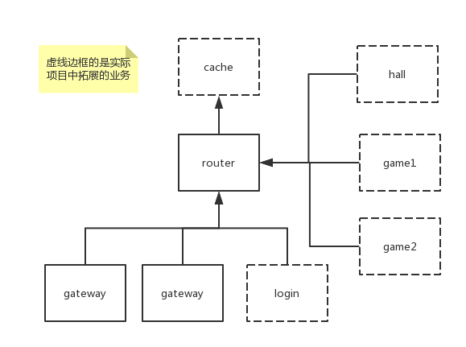

# quasar

## 说明
包括服务（进程）之间通信，消息事件注册，配置热更新，日志等。游戏场景剥离出来的

以当前生产业务下的场景拓扑结构为例



## 目录说明

```
cmd              网络消息处理
router           路由服，服务注册，数据转发等全局功能
gateway          网关服，负责客户端消息转发、负载均衡
config.xml       相关配置，如数据库账号密码，路由服地址等
config           配置热更新，待整理
```

## 表格配置
第一行方便阅读理解
表格数据通过（行，列）进行索引。以表格为例，(1,"Title") = "香蕉"
表格列".Private"默认为JSON隐藏数据，支持直接索引。以表格为例，(1,"Private1") = "h1"

序号 | 标题 | 自定义[JSON] |  数量[INT] | 属性[JSON] 
-|-|-|-|-
ID | Title | Custom | Num | .Private
1 | 香蕉 | {"Icon":"1.jpg","URL":"t.cn"} | 5 | {"Prviate1":"hi"}
2 | 苹果 | {"Icon":"2.jpg","From":"Jobs"} | 6 | {}
3 | 草莓 | {"Icon":"3.jpg","Total": 10} | 7 | {"Prviate1":"h3"}
